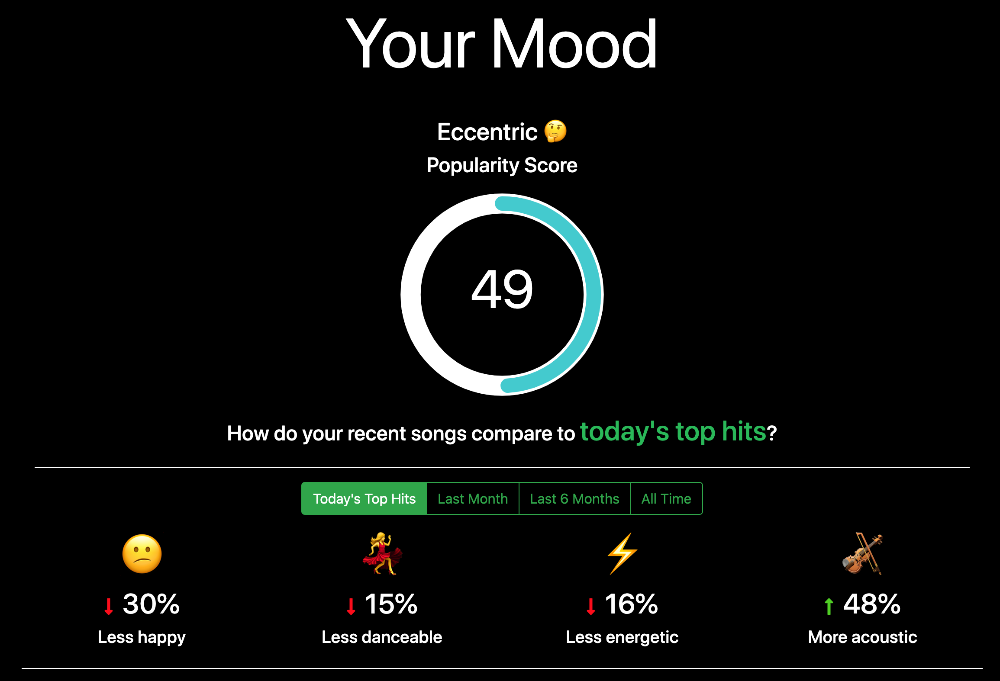

# Vibe

> Get insights into your vibe

Vibe gives you incredible insights into your listening habits. Compare your most recent songs to the top tracks of the day, your last month of listening, and even your favorite songs based on popularity, happiness, danceability, and more! Visualize trends in your favorite songs over your entire Spotify listening history and how they stack up against the top songs of each year. Rediscover the songs and artists you’ve been in love with the most.

[Try out Vibe](https://nicholas-lin.github.io/vibe)

## Features

- View the average popularity of your last 50 songs
- Compare your last 50 songs with the top tracks on Spotify for that day based on a variety of features
- Visualize trends in your top songs for each year based on valence (happiness), acousticness, etc. and how they compare with the top songs and average song of each year
- Examine your top tracks and artists from the last month, 6 months, and all time

## Built With

- [Spotify Web API](https://developer.spotify.com/documentation/web-api/)
- [React](https://reactjs.org/)
- [Bootstrap](https://getbootstrap.com/)

## Spotify API

This application uses following endpoints of the [**Spotify Web API**](https://developer.spotify.com/documentation/web-api/)

- [**Authorization**](https://developer.spotify.com/documentation/general/guides/authorization-guide/#implicit-grant-flow)
- [**Personalization API**](https://developer.spotify.com/documentation/web-api/reference-beta/#category-personalization) - [Get users Top Tracks and Artists](https://developer.spotify.com/documentation/web-api/reference/personalization/get-users-top-artists-and-tracks/)
- [**Player API**](https://developer.spotify.com/documentation/web-api/reference-beta/#category-player) - [Get Recently played tracks for user](https://developer.spotify.com/documentation/web-api/reference/player/get-recently-played/)
- [**Search API**](https://developer.spotify.com/documentation/web-api/reference-beta/#category-search) - [Search for an Item](https://developer.spotify.com/documentation/web-api/reference-beta/#endpoint-search)
- [**Playlists API**](https://developer.spotify.com/documentation/web-api/reference-beta/#category-playlists) - [Get a Playlist](https://developer.spotify.com/documentation/web-api/reference-beta/#endpoint-get-playlist)
- [**Tracks API**](https://developer.spotify.com/documentation/web-api/reference-beta/#category-tracks) - [Get Audio Features for a Track](https://developer.spotify.com/documentation/web-api/reference-beta/#endpoint-get-audio-features)

I used the Search and Playlist APIs to retrieve the user’s annual “top songs” playlist created by Spotify and the Personalization API to get the user’s Top Tracks and Artists. I then retrieved track features using the Tracks API and compared these values against the top Spotify songs during each respective time period. This React application uses the Web API directly in the client-side only and does not have a back-end.

### Creating a Spotify App

1. Go to https://developer.spotify.com/dashboard/, log in and create a new App.
2. Add `http://localhost:3000/` as _Redirect URI_ in your Spotify App Settings.
3. Grab the _Client Id_ that will be added to `.env` in the root directory of the repository.

## Try it out yourself

1. Clone the repository
2. Navigate to the root directory of the repository
3. `npm install`
4. `cp .env_EXAMPLE .env` and fill `REACT_APP_SPOTIFY_CLIENT_ID` with your client id and `REACT_APP_REDIRECT_URI` with `http://localhost:3000/`
5. `npm start`

Application is based on [create-react-app](https://github.com/facebook/create-react-app)

## What I Learned

This is the first project I have developed using a javascript framework/library. I learned so much about using the React js library and enjoyed the development process. I learned about class/functional components, JSX, props, state, and lifecycle methods. React js allowed me to organize my code so that I could adhere to DRY principles and better programming practices. React js was easier to learn than I had expected and I found it to be tremendously easier than using vanilla js like I had in the past. I look forward to exploring more projects with React hooks in the future. I also learned about making API requests by working with the Spotify API. I utilized concepts such as Async/await, promises, callbacks, etc. The thoughough documentation provided by Spotify was extremely helpful for learning how to make requests to the powerful endpoints and the responses to expect. I learned about the OAuth2 authentication flow, and decided to use an implicit grant flow since I did not want my application to rely on a backend. Once again, the Spotify documentation was extremely helpful in learning how to achieve this with no prior experience. This project has been extremely helpful in my growth as a developer.
